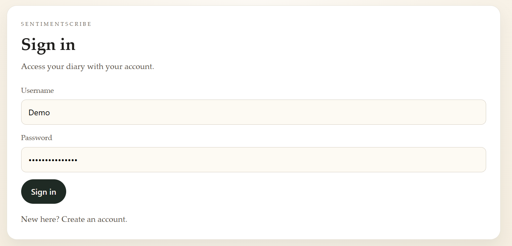
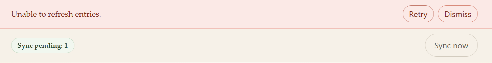
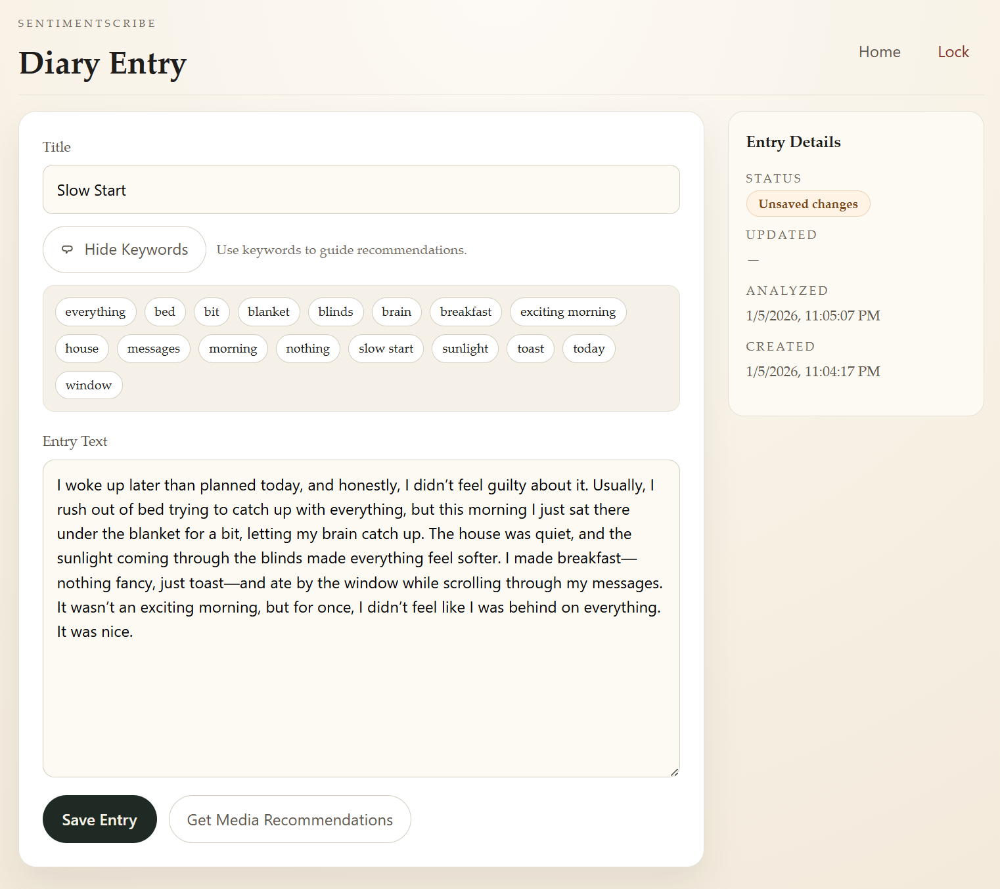

# SentimentScribe

Privacy-first journaling with end-to-end encrypted entries, offline-first sync, and intelligent music/movie recommendations.

**Live**: https://sentimentscribe.cloud  

---

## 📘 Project Overview

SentimentScribe is a modern journaling app designed for people who want the benefits of reflection and mood tracking without giving up privacy. It pairs a clean writing experience with optional analysis and recommendations.

What makes it unique is the way the product priorities shape the architecture: entries are encrypted in the browser (the server stores ciphertext only), the app works offline with an IndexedDB-backed cache + sync queue, and recommendations are generated on demand from the text you choose to analyze.

---

## 🌐 How to Use

Open https://sentimentscribe.cloud and:

1. **Create an account** (or sign in).
2. **Unlock your diary** with your passphrase (used to derive an encryption key locally).
3. **Write entries** and save them—entries stay available offline and sync when you’re back online.
4. **Analyze & get recommendations** when you want insights (keywords) or media suggestions (Spotify + TMDb).

---

## ✨ Features

- **Secure user authentication (JWT-based)**
  - Account registration/login issues a short-lived JWT used for API requests.
  - Per-user authorization ensures entries are scoped to the authenticated user.

- **Encrypted diary entries (end-to-end encryption)**
  - Entries are encrypted client-side using Web Crypto (AES-GCM) before they are saved or synced.
  - The backend persists ciphertext fields and encryption metadata only.

- **Offline-first journaling with sync**
  - Encrypted entries are cached in IndexedDB and can be created/edited offline.
  - A sync queue replays upserts/deletes when online, with a UI indicator for pending work.

- **Keyword extraction & analysis**
  - On-demand keyword extraction helps summarize themes without forcing a “mood tracker” workflow.
  - Analysis runs when you request it (not as a background job).

- **Spotify & TMDb recommendations**
  - Generates music and movie suggestions using extracted keywords as a “mood + theme” signal.
  - Designed to be useful with short entries, not just long-form writing.

- **Pagination & load-more recommendations**
  - Recommendations are grouped into pages with “Load more” controls so results stay fast and readable.

---

## 🛠️ Technical Details

### Backend (Spring Boot)

- **Spring Boot REST API** serving `/api/**` endpoints (auth, entries, analysis, recommendations).
- **Clean Architecture-inspired structure**:
  - `domain/` for core entities/value objects
  - `usecase/` for interactors + ports (framework-agnostic business rules)
  - `web/` for controllers + DTOs
  - `persistence/postgres/` for Postgres adapters/entities/repositories
- **JWT authentication** with stateless security (bearer tokens) and protected endpoints.
- **Flyway migrations** manage schema evolution (see `backend/src/main/resources/db/migration/`).

### Frontend (React + Vite)

- **React + TypeScript SPA** built with Vite.
- **Clear component/page structure** under `frontend/src/pages` and `frontend/src/components`.
- **API integration** via a single request layer (`frontend/src/api/http.ts`) with typed DTOs and JWT attachment.
- **Crypto & offline modules** are intentionally separated:
  - `frontend/src/crypto` (key derivation + encryption envelope)
  - `frontend/src/offline` (IndexedDB stores + sync engine)

### Database (PostgreSQL)

- **PostgreSQL** stores user accounts and diary entries.
- **Ciphertext-only entry storage**:
  - Entry rows contain ciphertext + IVs + algorithm/version metadata.
  - Unique constraints scope entries to a user + storage path.
- **Migration strategy**:
  - Flyway versioned SQL migrations apply automatically on startup in the `postgres` profile.

---

## 🔐 Privacy & Security Model

SentimentScribe is built around a simple rule: **the backend should never need plaintext diary content to store your journal.**

- **Client-side encryption (Web Crypto API)**
  - The browser derives a key from a passphrase (PBKDF2 parameters are provided per user).
  - Entries are encrypted with **AES-GCM** into a small “envelope” containing ciphertext + IVs + metadata.
- **Backend stores ciphertext only**
  - The API persists encrypted fields and cannot decrypt entries on its own.
- **Keys never leave the device**
  - The derived key is held in memory only and is cleared when you lock or close the tab.
- **JWT-based stateless authentication**
  - JWTs authenticate API requests; encryption keys are a separate, client-side concern.

Important product note: **analysis and recommendations are opt-in actions**. When you request keywords or recommendations, the text you submit is sent to the backend so it can run NLP and query third-party APIs.

---

## 📴 Offline Support

Offline mode is designed to be practical (not “demo offline”):

- **IndexedDB** stores encrypted entry records locally (ciphertext only).
- **Sync queue** captures edits and deletes while offline and replays them when online.
- **Conflict handling (high level)**
  - Local records track “dirty” updates and tombstones so server refreshes don’t overwrite offline edits.
  - Sync retries stop on first failure to avoid cascading bad state; the UI surfaces pending work.

---

## 🧰 Technologies & APIs

- [Java](https://www.java.com/) / [Spring Boot](https://spring.io/projects/spring-boot)
- [React](https://react.dev/) + [Vite](https://vitejs.dev/)
- [PostgreSQL](https://www.postgresql.org/)
- [Docker](https://www.docker.com/)
- AWS: [EC2](https://aws.amazon.com/ec2/), [S3](https://aws.amazon.com/s3/), [CloudFront](https://aws.amazon.com/cloudfront/), [SSM Parameter Store](https://docs.aws.amazon.com/systems-manager/latest/userguide/systems-manager-parameter-store.html)
- [Spotify Web API](https://developer.spotify.com/documentation/web-api)
- [TMDb API](https://developer.themoviedb.org/docs)
- [Web Crypto API](https://developer.mozilla.org/en-US/docs/Web/API/Web_Crypto_API)
- [IndexedDB](https://developer.mozilla.org/en-US/docs/Web/API/IndexedDB_API)

---

## 🚀 Deployment Overview

SentimentScribe is deployed with “real” production constraints in mind: static hosting for the SPA, a containerized API, and managed configuration.

- **Frontend (S3 + CloudFront)**
  - The React app builds to static files (`frontend/dist`) and is served via S3 behind CloudFront for global caching and HTTPS.
  - The frontend points at the API using `VITE_API_BASE_URL` at build time.
- **Backend (Docker on AWS EC2)**
  - The Spring Boot API is built into a Docker image and run on EC2 (see `deploy/ec2/docker-compose.prod.yml`).
  - A reverse proxy terminates HTTPS and routes traffic to the API container.
- **Configuration (SSM Parameter Store)**
  - Secrets and environment-specific values (DB creds, JWT secret, API keys, CORS allowlist) are stored in SSM and rendered into environment variables for the running containers.

This architecture keeps the frontend cheap and fast to serve, isolates backend concerns behind a stable API, and supports incremental hardening without rewriting the app.
